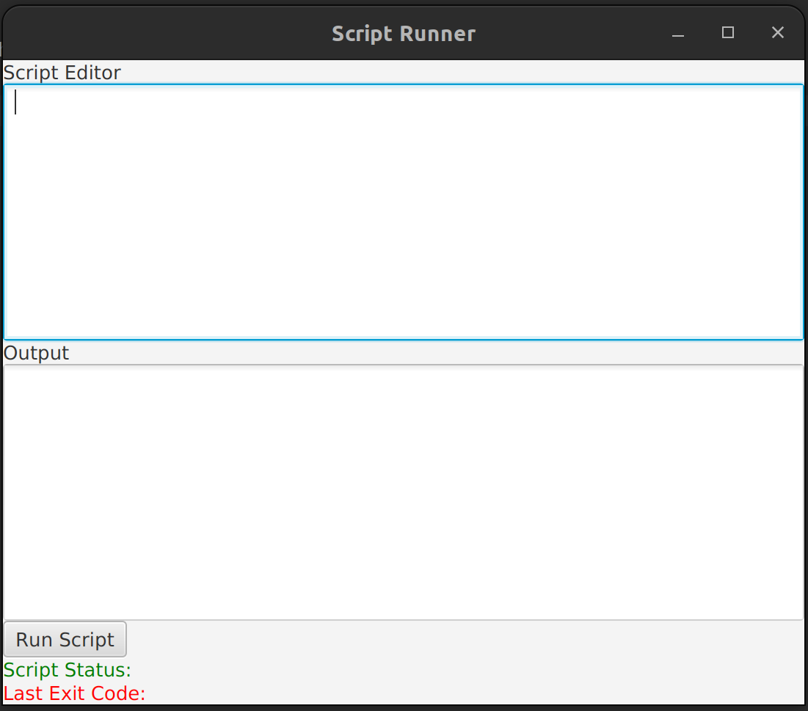
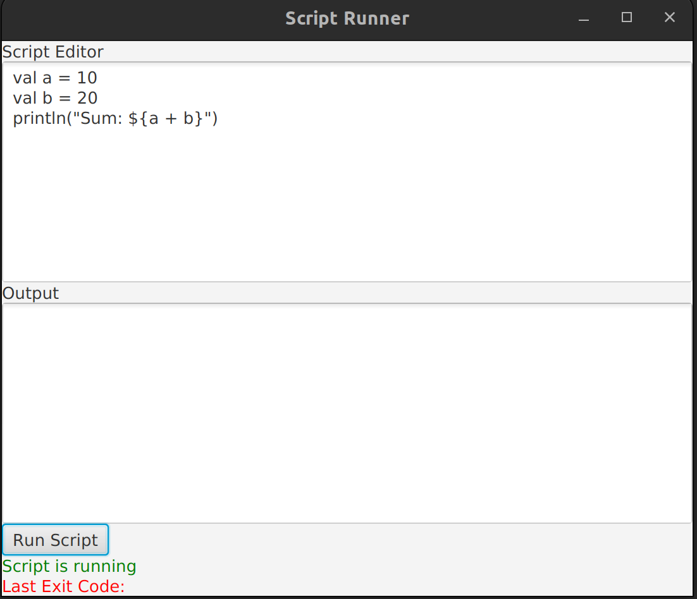
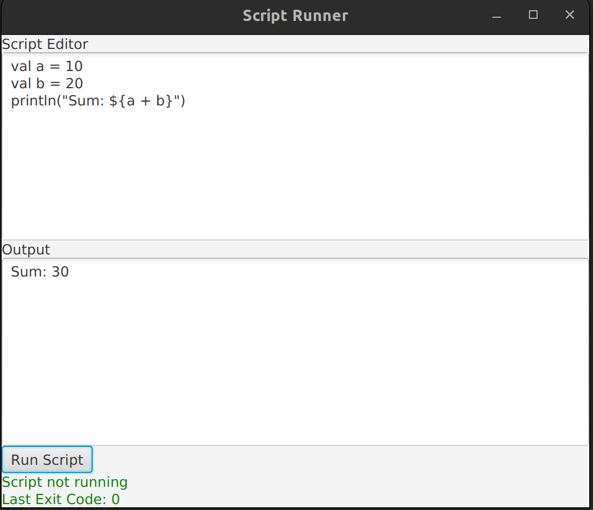
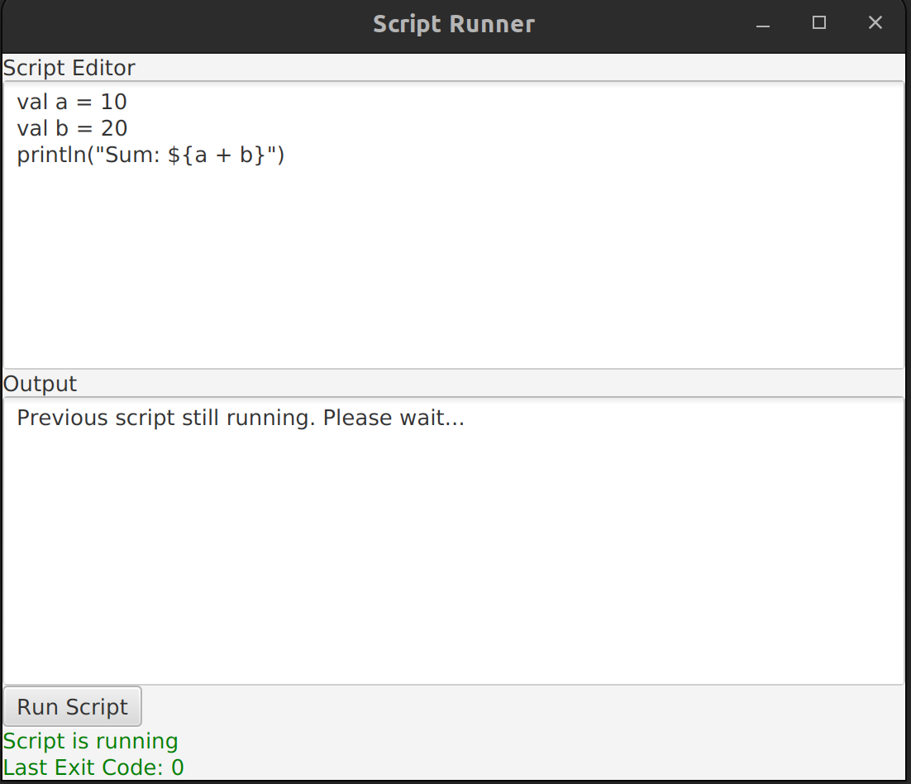
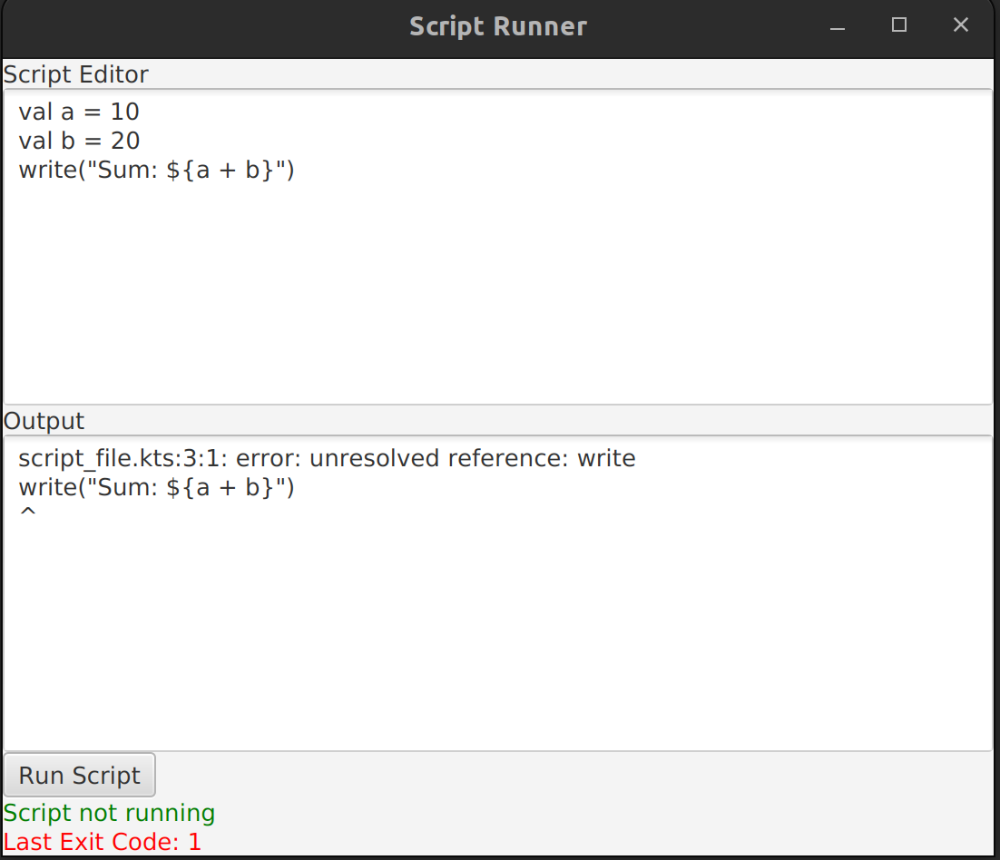

# Test task for JetBrains internship

## Launch instructions:

Please run the project by running: `./gradlew run`

You will see this window:

You can enter script code in the editor window and press button `Run script`. Then you will see this:

After successful running script, you will see the result:

If you try to run script while another script is running, you will see this:

If there is an error while running script, you will see it:

